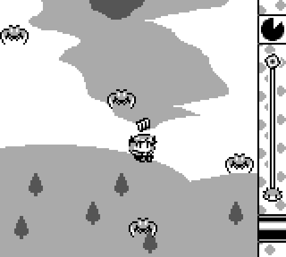
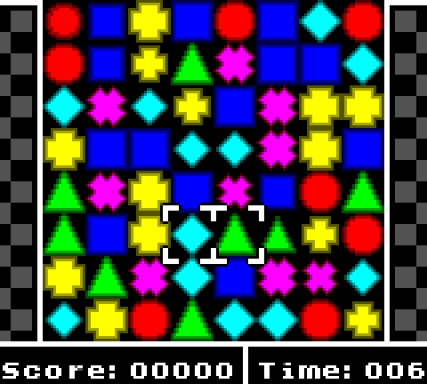
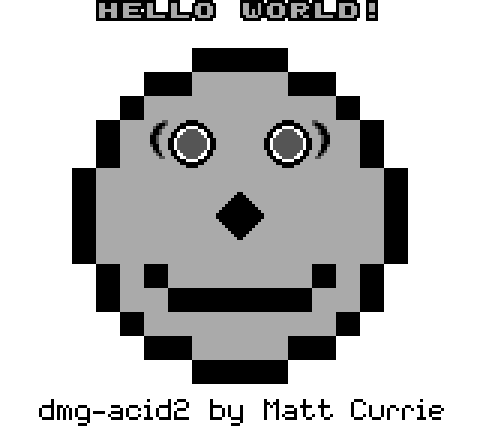
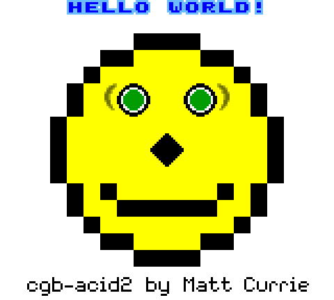
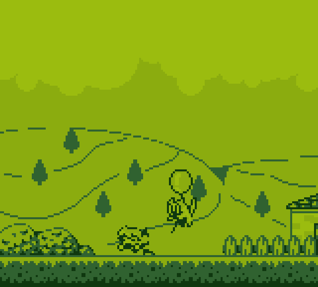
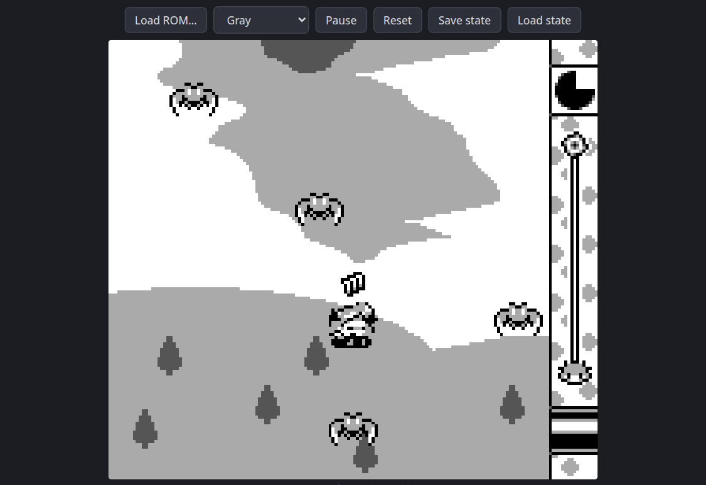
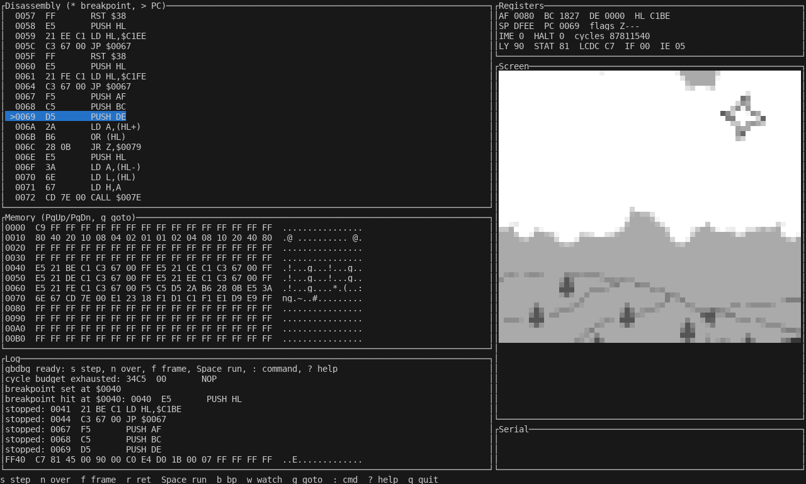

# gbemu

A Game Boy / Game Boy Color emulator written from scratch in Rust, with no emulator crates: SM83 CPU, scanline PPU
with dot-accurate mode timing, four-channel APU, timer, serial, joypad, MBC1/2/3(RTC)/5, save states and rewind.
`gb-core` has no I/O (its only dependencies are `serde` and `bincode`, for save states), so the same core drives a
desktop window, a terminal, a TUI debugger, a headless test runner and a WebAssembly build.
It passes all 152 scored test ROMs (blargg, mooneye, acid2, CGB, MBC suites) and plays real homebrew.

Documentation: [how it works](docs/ARCHITECTURE.md) · [how it was built](docs/DEVLOG.md) · `PLAN.md` · `PROGRESS.md`.

**Try it in the browser: <https://printerjam.github.io/gbemu/>** (bring your own ROM; nothing is uploaded).

<p align="center">
  
  
</p>
<p align="center">
  
  
</p>

| `gbterm`: truecolor half-block terminal frontend | the browser build |
|---|---|
|  |  |



*`gbdbg`, the TUI debugger. All screenshots were produced by this repository's own tools (`gbemu --screenshot-at-frame`, `gbterm --dump-frame-ansi`, `gbdbg` under tmux, the web build in Chromium); the game
screenshots are scaled 3x with nearest-neighbour.*

Screenshot credits (no ROMs are included in this repository):
[Tobu Tobu Girl](https://github.com/SimonLarsen/tobutobugirl) by Tangram Games / Simon Larsen (MIT);
[Geometrix](https://github.com/AntonioND/geometrix) by Antonio Niño Díaz (GPL-3.0-or-later);
[dmg-acid2](https://github.com/mattcurrie/dmg-acid2) and [cgb-acid2](https://github.com/mattcurrie/cgb-acid2) by Matt Currie (MIT).

## Features

- **CPU/timing:** every memory access advances the whole machine one M-cycle; interrupts, HALT bug, EI delay.
- **PPU:** DMG and CGB, background/window/sprites, CGB palettes and VRAM banking; pixel-exact dmg-acid2 and cgb-acid2.
- **APU:** four channels, frame sequencer, CGB/DMG quirks; blargg `dmg_sound` and `cgb_sound` pass.
- **Cartridges:** ROM only, MBC1 (incl. multicarts), MBC2, MBC3 with RTC (up to MBC30), MBC5; battery saves.
- **Save states and rewind:** versioned, checksummed state files (F1..F4); about 20 seconds of rewind history.
- **Frontends:** `gbemu` (window + audio, scriptable input and screenshots), `gbterm`, `gbdbg`, WebAssembly.
- **Tooling:** `gbtest` runs the whole free test-ROM collection and guards against regressions.

### Test scoreboard

| Suite | Passed | Total |
|---|---|---|
| blargg | 19 | 19 |
| mooneye | 66 | 66 |
| mooneye-mbc | 28 | 28 |
| acid2 | 1 | 1 |
| cgb | 34 | 34 |
| mbc3 | 4 | 4 |
| **Score** | **152** | **152** |

Beyond the scored suites, `scripts/scoreboard.sh` tracks 6161 ROMs from the wider collection (gambatte, gbmicrotest, mealybug, age, same-suite, wilbertpol...), currently 3513 passing.
Live numbers and milestone evidence are in [`PROGRESS.md`](PROGRESS.md); architecture and contracts in
[`PLAN.md`](PLAN.md).

## Quick start

```sh
git clone https://github.com/printerjam/gbemu && cd gbemu
cargo build --release
scripts/fetch-roms.sh                                    # free test ROMs into ./roms (optional)
target/release/gbemu roms/dmg-acid2/dmg-acid2.gb         # window, 4x scale
target/release/gbterm roms/dmg-acid2/dmg-acid2.gb        # same, in a truecolor terminal
target/release/gbtest                                    # run the test-ROM scoreboard
```

For something to play, download a free homebrew game from the [Homebrew Hub](https://hh.gbdev.io/), for example
[Tobu Tobu Girl](https://hh.gbdev.io/game/tobutobugirl), and pass its `.gb` file to `gbemu`. Linux needs the ALSA
development headers (`libasound2-dev`) for audio; the web build is described in `scripts/build-web.sh`.

## Build

```sh
cargo build --release          # all binaries land in target/release/
cargo test --release           # unit + integration tests (ROM-driven ones skip when roms/ is absent)
```

Needs a recent stable Rust toolchain. `gbemu` links minifb (X11/Wayland on Linux) and cpal (ALSA development
headers on Linux, e.g. `libasound2-dev`); the other binaries only need a terminal.

## Binaries

| Binary | Crate | What it is |
|---|---|---|
| `gbemu` | `gb-desktop` | Windowed frontend with audio, battery saves, save states, rewind |
| `gbterm` | `gb-term` | Terminal frontend (truecolor, half-block rendering) |
| `gbtest` | `gb-runner` | Headless test-ROM runner, scoreboard, single-ROM runner, CPU tracer |
| `gbdbg` | `gb-debug` | TUI debugger with a scriptable command mode |

```sh
target/release/gbemu game.gb [--scale N] [--palette gray|dmg-green|pocket] [--mute]
                             [--screenshot-at-frame N --screenshot out.png] [--exit-after-frames N]
                             [--input-script FILE]
target/release/gbterm game.gb [--palette gray|dmg-green|pocket] [--exit-after-frames N] [--dump-frame-ansi FILE]
target/release/gbdbg game.gb [--script FILE|-]      # `help` inside lists the commands
```

Battery-backed cartridge RAM (and the MBC3 real-time clock) is stored next to the ROM as `<rom>.sav` and written
every few seconds and on exit.

### Keys

| | `gbemu` | `gbterm` |
|---|---|---|
| D-pad | arrow keys | arrow keys or W A S D |
| A / B | X / Z | X or K / Z or J |
| Start | Enter | Enter |
| Select | Backspace or Right Shift | Backspace or Shift+Tab |
| Pause | P | P |
| Quit | Esc | Q or Esc |
| Reset | R | |
| Fast-forward | hold Tab | |
| Screenshot | F12 (`<rom>.N.png`) | |
| Save state | F1..F4 (slots 1..4) | F1 or `[` (slot 1) |
| Load state | Shift+F1..F4 | F2 or `]` (slot 1) |
| Rewind | hold Q | hold R |

`gbterm` needs a terminal with truecolor support; key releases are only reported by terminals that implement the
kitty keyboard protocol, otherwise a pressed key counts as held for a few frames (repeat keeps it held).

### Save states

States are files next to the ROM: `<rom>.ss1` .. `<rom>.ss4`. A state contains the complete machine (CPU, PPU, APU,
timer, memory, cartridge RAM and bank registers, RTC) but not the ROM; it is refused when it belongs to another ROM
(header and global checksum, ROM length), has been corrupted (CRC-32), or was written by an incompatible version.
Display palette and audio sample rate are not part of a state. Library API: `GameBoy::save_state()` /
`GameBoy::load_state(&[u8])`.

### Rewind

Both frontends keep about 20 seconds of history (a snapshot every 4 frames, stored as compressed deltas, a few
hundred bytes each for typical scenes). Hold the rewind key to run time backwards at 4x; release to continue from
that point. Library API: `gb_core::Rewind`.

### Cheats

`gbemu` and `gbterm` accept `--cheat CODE` (repeatable). Game Genie codes (`ABC-DEF-GHI`, or `ABC-DEF` without
compare byte) patch ROM reads; GameShark codes (`01VVLLHH`, RAM addresses A000-DFFF) are written once per frame.
Cheats are a host setting: they are not stored in save states. Library API: `GameBoy::add_cheat` / `clear_cheats`.

### Web build

`scripts/build-web.sh --serve` builds `web/pkg/` and serves `web/`. The page supports keyboard, touch (single d-pad
surface, diagonals by touch angle) and standard-mapping gamepads (d-pad / left stick, A/B = buttons 0/1, Select/Start =
8/9), has a per-ROM cheat box (Game Genie / GameShark lines, saved in localStorage) and is an installable PWA: a
service worker caches the app shell and the wasm, so it works offline after the first load.

### Scripted input (`gbemu --input-script FILE`)

One action per line, `#` starts a comment; the frame number counts displayed frames:

```
120 start down     # press, then release, a button
125 start up
300 save 1         # same as F1
400 load 1
500 rewind 25      # step back 25 rewind snapshots, then stay on that frame
```

Combined with `--screenshot-at-frame` and `--exit-after-frames` this gives fully automated runs.

## Test ROMs and the scoreboard

The free test suites ([c-sp/game-boy-test-roms](https://github.com/c-sp/game-boy-test-roms), blargg, mooneye,
dmg-acid2, rtc3test, mbc3-tester and others) are not stored in the repository:

```sh
scripts/fetch-roms.sh           # downloads and unpacks into ./roms
target/release/gbtest           # scored suites: blargg, mooneye, mooneye-mbc, acid2, mbc3; prints SCORE: passed/total
target/release/gbtest --suite mooneye --filter timer     # a subset
target/release/gbtest --suite blargg-extra               # unscored suites (dmg_sound, oam_bug)
target/release/gbtest --markdown --screenshots out/shots # report and failing screenshots
target/release/gbtest run roms/dmg-acid2/dmg-acid2.gb --frames 60 --screenshot acid2.png
```

Mooneye ROMs pass when they execute `LD B,B` with B,C,D,E,H,L = 3,5,8,13,21,34; blargg ROMs when the serial output
says `Passed` (or the screen matches the reference); acid2, rtc3test and mbc3-tester by an exact pixel comparison
with the reference screenshot.

### CPU trace and Gameboy Doctor

```sh
target/release/gbtest bench game.gb --frames 3000          # headless speed; scripts/bench.sh runs a small table
target/release/gbtest trace game.gb --steps 100             # disassembly + registers per instruction
target/release/gbtest trace game.gb --doctor --steps 1000   # Gameboy Doctor log format (LY reads as 0x90)
scripts/doctor.sh 4                                         # diff blargg cpu_instrs/individual/04 against the truth log
```

`scripts/doctor.sh` downloads the truth logs from `robert/gameboy-doctor` into `out/doctor/` on first use and prints
the first diverging line with context.

## Layout

```
crates/gb-core      the emulator core: cpu, ppu, apu, timer, serial, joypad, bus, cartridge, state, rewind, disasm
crates/gb-desktop   gbemu
crates/gb-term      gbterm
crates/gb-runner    gbtest
crates/gb-debug     gbdbg
scripts/            fetch-roms.sh, doctor.sh
```

Supported cartridges: ROM only, MBC1 (including multicarts), MBC2, MBC3 (with RTC, up to MBC30 sizes), MBC5
(including rumble carts). Other mapper types are rejected with `CartError::Unsupported`.
